# Medical & Acoustic Signals Viewer

A comprehensive signal visualization and analysis tool for medical, acoustic, and RF signals with AI-powered abnormality detection and multiple viewing modes.


---
## 🌐 Our Website

This is our website project built by our team.

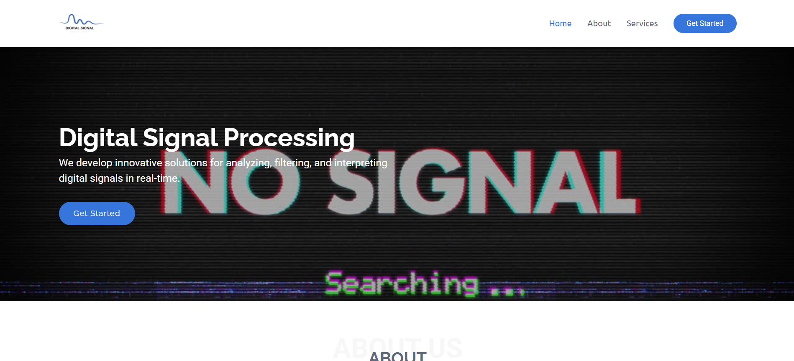

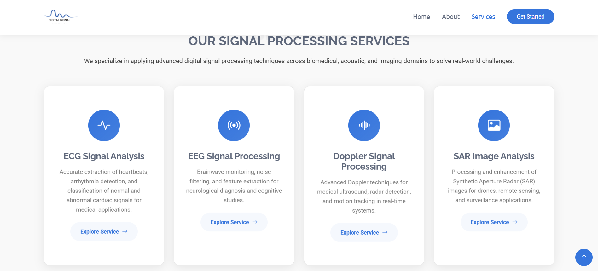


## Table of Contents

- [Features](#features)
- [Tech Stack](#tech-stack)
- [Project Structure](#project-structure)
- [Prerequisites](#prerequisites)
- [Installation Guide](#installation-guide)
- [Signal Views](#signal-views)
- [API Endpoints](#api-endpoints)

---

## Features

### Medical Signals (ECG/EEG)
- **Multi-channel signal visualization** with 4 abnormality types
- **AI-powered abnormality detection** using pre-trained models
- **Multiple viewing modes**: Continuous-time, XOR graph, Polar graph, Recurrence plot
- **Real-time controls**: Speed, zoom, pan, play/stop
- **Channel selection** and colormap customization

### Acoustic Signals
- **Vehicle-Passing Doppler Effect** simulation with adjustable velocity and frequency
- **Real vehicle sound analysis** with AI-based velocity and frequency estimation
- **Drone/Submarine detection** from acoustic data

### RF Signals
- **SAR/Cosmic signals visualization**
- **Signal parameter estimation** and analysis

---

## Tech Stack

**Frontend:**
- HTML, CSS, JavaScript
- Plotly.js for signal visualization

**Backend:**
- Python (Flask)
- NumPy, Pandas, SciPy
- TensorFlow / PyTorch (for AI model)
- Matplotlib (for plotting)
- joblib (for loading pretrained model)

---

## Project Structure

```
Project/
│
├── Frontend/
│   ├── assets/
│   │   ├── css/
│   │   ├── img/
│   │   └── js/
│   │       ├── doppler-analyzer.js
│   │       ├── drone-detector.js
│   │       ├── ecg-analyzer.js
│   │       ├── eeg-analyzer.js
│   │       └── main.js
│   ├── vendor/
│   ├── Doppler-Analysis.html
│   ├── drone-detector.html
│   ├── ECG-Analysis.html
│   ├── EEG-Analysis.html
│   ├── index.html
│   ├── .gitignore
│   └── README.md
│
└── Backend/
    ├── __pycache__/
    ├── static/
    ├── uploads/
    ├── venv/
    ├── __init__.py
    ├── app.py
    ├── config.py
    ├── doppler_app.py
    ├── doppler_processor.py
    ├── ecg.py
    ├── model_runner.py
    ├── model.py
    ├── requirements.txt
    └── test_backend.py
```

---

## Prerequisites

- Python 3.8 or higher
- 4GB RAM minimum
- 500MB free disk space
- Microphone (for acoustic analysis)

---

## Installation Guide

### 1. Clone the repository
```bash
git clone https://github.com/your-username/signal-viewer.git
cd signal-viewer
```

### 2. Create virtual environment
```bash
python -m venv venv
source venv/bin/activate  # On Windows: venv\Scripts\activate
```

### 3. Install dependencies
```bash
pip install -r requirements.txt
```

### 4. Run the server
```bash
python app.py
```

---

## Signal Views

### Part-01: ECG Multichannel Signal Viewer

#### 1. Continuous Signal Viewer
- Real-time scrolling display of 12-lead ECG
- Adjustable window size and playback speed
- Lead selection and color customization

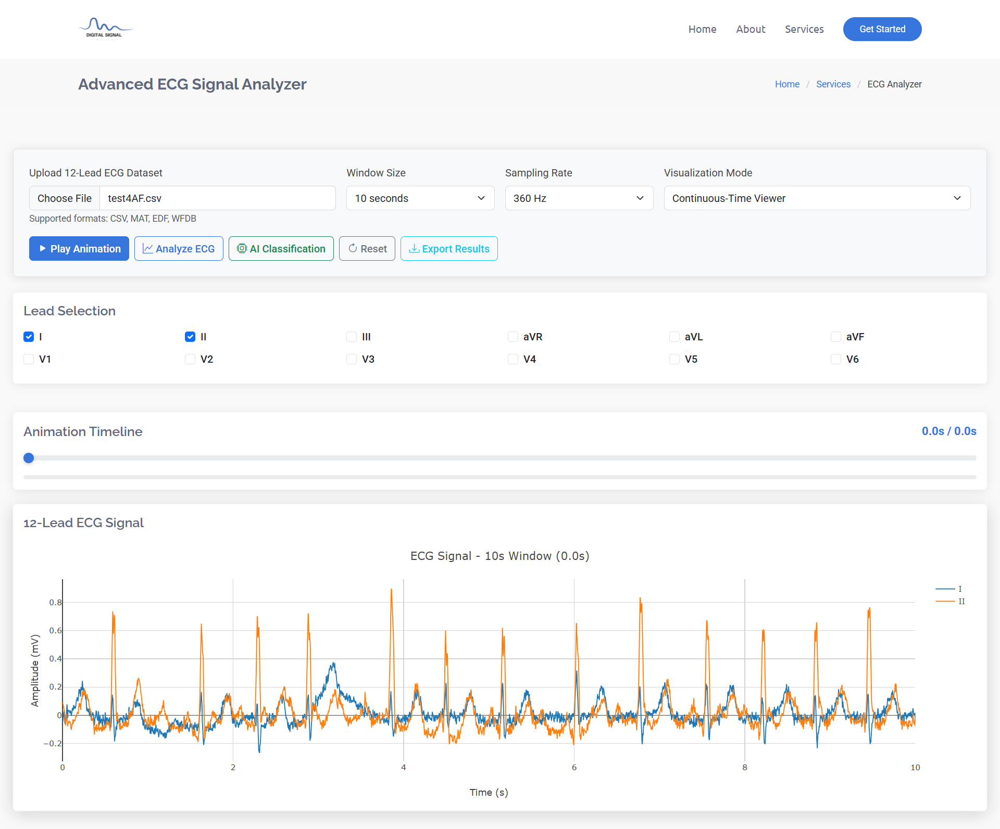

--- 

#### 2. Polar Graph
- Circular representation of ECG signals
- Fixed window or cumulative modes
- Magnitude (r) vs Time (θ) coordinates

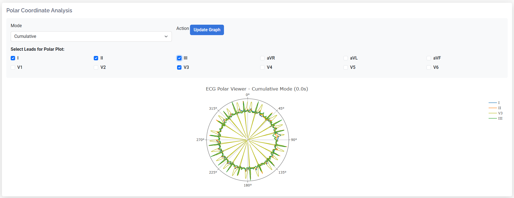

#### 3. XOR Graph
- Chunk-based signal comparison
- Overlay and difference display modes
- Identical chunks cancel out (XOR operation)

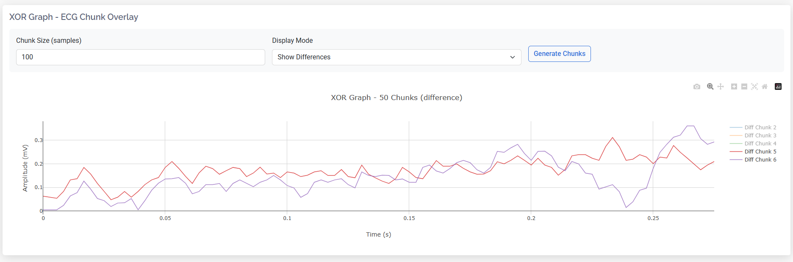

#### 4. Recurrence Plot
- Scatter plot between two selected leads
- Heatmap density visualization
- Correlation analysis between channels

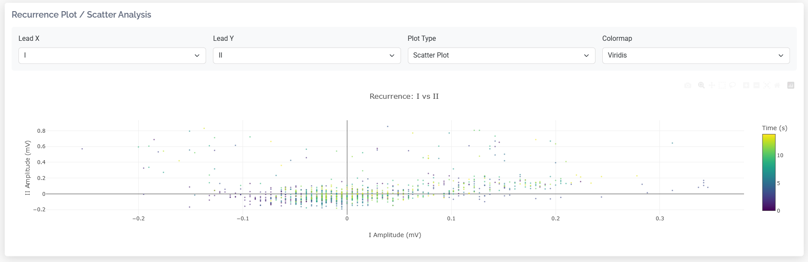

---

### AI Model for Classification (ECG Signal)

**Datasets Link:** https://www.physionet.org/content/ecg-arrhythmia/1.0.0/

**Model Link:** https://github.com/antonior92/automatic-ecg-diagnosis.git

**Pretrained Model Link:** https://zenodo.org/records/3765717

**Classification Diseases:**
- 1st degree AV block (1dAVb)
- Right bundle branch block (RBBB)
- Left bundle branch block (LBBB)
- Sinus bradycardia (SB)
- Atrial fibrillation (AF)
- Sinus tachycardia (ST)

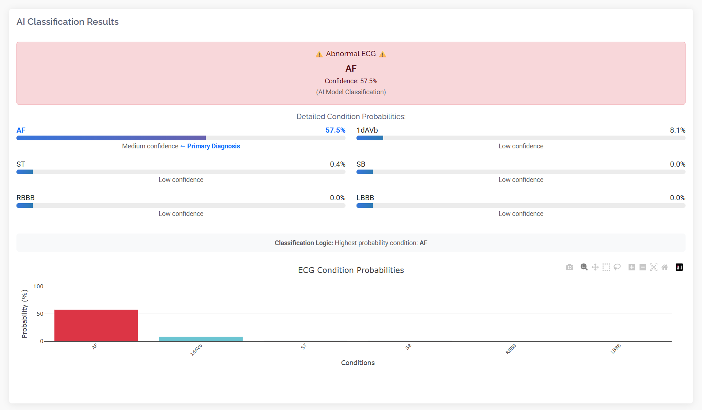


---

### Part-02: EEG Multichannel Signal Analyzer

A comprehensive EEG (Electroencephalography) signal visualization and analysis tool with multiple viewing modes, real-time animation, and advanced signal processing capabilities.

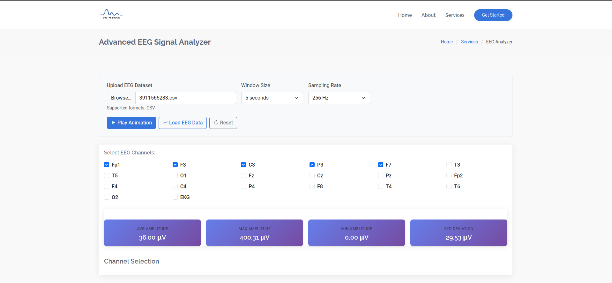

#### Features

- **Multi-channel EEG visualization** with up to 20+ channels
- **Wave band filtering**: Delta, Theta, Alpha, Beta, Gamma, and All bands
- **Multiple viewing modes**: Multichannel, Polar Analysis, Recurrence Plot
- **Real-time animation**
- **Channel selection** with individual on/off controls
- **Interactive timeline** slider for signal navigation

#### 1. Multichannel Signal Viewer

Real-time visualization of multiple EEG channels with vertical stacking and offset for clarity.

**Features:**
- Select up to 20 channels simultaneously
- Adjustable time window (1-10 seconds)
- Wave band filtering (Delta: 0.5-4 Hz, Theta: 4-8 Hz, Alpha: 8-13 Hz, Beta: 13-30 Hz, Gamma: >30 Hz)
- Channel color coding for easy identification
- Interactive hover tooltips showing amplitude and time

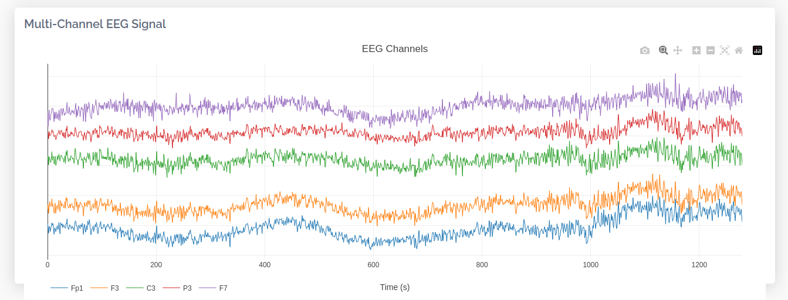

#### 2. Polar Graph Analysis

Circular representation of EEG signals in polar coordinates for pattern recognition and phase analysis.

**Modes:**
- **Fixed Window**: Analyzes a static time window of the signal
- **Dynamic Mode**: Real-time polar representation following the current time point

**Features:**
- Multi-channel overlay (up to 4 channels for clarity)
- Amplitude (r) vs Angular Position (θ) visualization
- Channel-specific color coding
- Smooth spline interpolation for better visualization


#### 3. Recurrence Plot

Advanced phase-space analysis showing the relationship between two selected EEG channels.

**Features:**
- **Scatter Plot Mode**: Visualizes point-by-point relationships


**Small Recurrence Plot** (Side Panel):
- Independent channel selection (Channel X vs Channel Y)
- Quick comparison view
- Real-time updates with dropdown selection

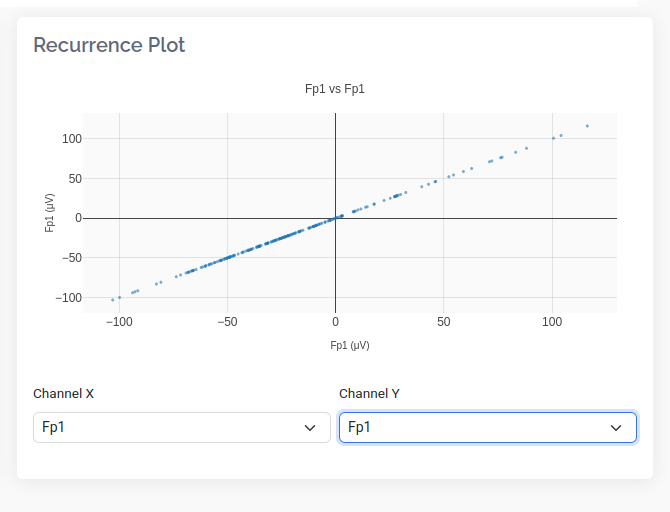

#### Controls & Settings

**Timeline Controls:**
- Play/Pause animation
- Timeline slider for manual navigation
- Current time and total duration display
- Progress bar indicator

**Channel Selection:**
- Individual channel checkboxes
- Select All / Deselect All options
- Color-coded channel labels

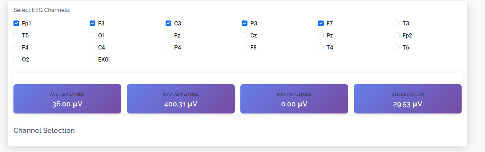


**Recurrence Plot Settings:**
- Channel 1 & 2 dropdowns
- Scatter
- Update button for manual refresh
---
## Part-03: Doppler Sound Generation & Vehicle Sound Analysis

### 1. Doppler Sound Generation
- Simulates the *Doppler effect* produced by a vehicle passing by an observer using a **physics-based acoustic model**.  
- Adjustable parameters:  
  - **Base frequency (f)** 
  - **Vehicle velocity (v)** (0–500 km/h)  
  - **Duration** of the generated sound  
- Produces realistic *approach and recede phases* with amplitude variation over distance.  
- Provides *interactive waveform visualization* with options to **play**, **pause**, and **download** the generated signal.  


---

### 2. Vehicle Sound Analysis

#### (a) Signal Visualization
- Displays the *time-domain waveform* of the uploaded vehicle sound.  
- Highlights amplitude variations as the vehicle approaches and passes the observer.  
- Allows users to inspect signal patterns and identify transitions between approach and recede phases.  


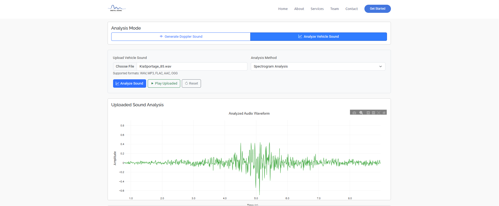

---

#### (b) Doppler Analysis Model
- Applies the *physics-based Doppler model* to estimate the change in observed frequency over time.  
- Uses the *Doppler equation*:

$$
f' = f \times \frac{v_s}{v_s \pm v}
$$

  Where:  
  - \( f' \): Observed frequency  
  - \( f \): Source frequency  
  - \( v_s = 343\,m/s \): Speed of sound  
  - \( v \): Vehicle velocity  
- Detects and calculates:  
  - *Approach and recede frequencies*  
  - *Estimated velocity (km/h)*  
  - *Source frequency*  
  - *Confidence score*  
- Displays the computed *numerical results* for analysis and validation.  


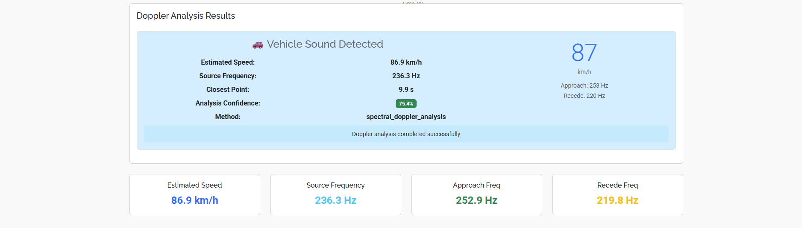

---

#### (c) Spectrogram Analysis
- Generates a *time–frequency spectrogram* using the *Short-Time Fourier Transform (STFT)*.  
- Visualizes frequency shift patterns where higher frequencies represent the approach and lower frequencies the recede phase.  
- Color intensity (in dB) reflects signal energy concentration.  
- Enables precise observation of *frequency variation due to motion* and *confidence assessment* of detected Doppler shifts.  


---


## Part-04: 1. Synthetic Aperture Radar (SAR) Analyzer  

This project is an interactive Flask-based web application for analyzing SAR (Synthetic Aperture Radar) `.tif` or `.tiff` datasets.  
It allows users to upload SAR image files, visualize them in grayscale, inspect metadata, plot center-line signal profiles, and compute their FFT spectrum to reveal dominant frequency components — all in a sleek, web-based dashboard.

### Features

- **Upload & Process TIFF Files**  
  Supports `.tif` and `.tiff` SAR datasets.  
  Automatically reads large files efficiently using `tifffile` with memory mapping.

- **Visualization Dashboard**  
  Displays grayscale SAR image (log-scaled intensity).  
  Plots the center-line signal (1D slice of pixel amplitude).  
  Generates and visualizes the FFT spectrum (frequency domain).

- **Metadata Extraction**  
  Displays key TIFF metadata (dimensions, tags, and geotags).  
  Summarized neatly in a responsive table.

- **Interactive Front-End**  
  Built using HTML, Bootstrap, and JavaScript (`fetch()` for live communication).  
  Real-time loading indicators and dynamic visualization rendering.

- **Error Handling**  
  Catches TIFF read errors, invalid file formats, and dimensional inconsistencies.  
  Provides detailed debug logs for developers.

### How It Works

1. User uploads a `.tif`/`.tiff` SAR dataset.  
2. Flask backend saves and parses it using `tifffile`.  
3. The app extracts metadata and reads image intensity values.  
4. A center line (horizontal slice) is taken for signal analysis.  
5. The FFT (Fast Fourier Transform) is computed using `scipy.fft`.  
6. All visualizations are generated with Matplotlib, converted to Base64, and rendered dynamically on the web interface.


### Example Outputs

**SAR Image (Gray Intensity)**  
Shows radar backscatter intensity in decibels (dB).

**Center Line Signal**  
1D amplitude profile extracted from the middle row of the SAR image.

**FFT Spectrum**  
Frequency-domain representation with detected dominant frequency displayed.


---

## Part-04: 2. Drone Sound Detector  

This project is a Flask-based web application that detects and classifies drone sounds using **Google’s YAMNet model**, a pre-trained deep learning audio classifier developed by Google Research.  

It provides an interactive dashboard that allows users to upload an audio file and visualize detection results in real-time — identifying sounds as **Drone**, **Bird**, or **Noise** categories with confidence scores and class breakdowns.

### Project Overview

The app uses **YAMNet**, a TensorFlow model trained on AudioSet, to analyze sound events and classify them into 521 audio classes.  
For this project, the focus is narrowed to three main categories relevant to aerial and environmental sound detection:

- Drone  
- Bird  
- Noise  

### Features

- Real YAMNet-based sound classification  
- Flask backend for model inference  
- Frontend dashboard with Bootstrap styling  
- Real-time confidence visualization  
- Category and sub-class score breakdowns  
- Responsive and modern interface  

### How It Works

1. Upload an audio file from the web interface.  
2. The Flask backend:  
   - Loads the YAMNet model.  
   - Preprocesses the audio file (resampling, waveform extraction, normalization).  
   - Runs the model to obtain embeddings and class scores.  
   - Aggregates class scores into:  
     - Drone-related sounds  
     - Bird-related sounds  
     - Noise/background sounds  
3. The frontend displays:  
   - Category confidence bars  
   - Individual class probabilities  
   - Top YAMNet detections  
   - File information (type, size, analysis time)


### Example Outputs


## API Endpoints

### ECG Endpoints
- `/api/upload-ecg`
- `/api/classify-ecg`
- `/api/get_polar_data/<mode>`


### EEG Endpoints
- `/api/eeg/health`
- `/api/eeg/upload`
- `/api/eeg/get_polar_data/<mode>`
- `/api/eeg/get_recurrence_data`

### Doppler Endpoints
- `/api/generate-doppler-sound`
- `/api/analyze-vehicle-sound`
- `/api/get-spectrogram`

### Drone Detection Endpoint
- `/upload-drone-audio`

### SAR Analyzer Endpoint
- `/api/analyze-sar`
- 
---  
# 👥 Team Members

| Name                           | University Code |
| ------------------------------ | --------------- |
| Alhussien Ayman Hanafy Mohamed | 9230235         |
| Saif Mohammed Ali              | 9230467         |
| Mai Mahmoud Mohamed Ibrahim    | 9230934         |
| Suhila Tharwat Elmasry         | 9230455         |

